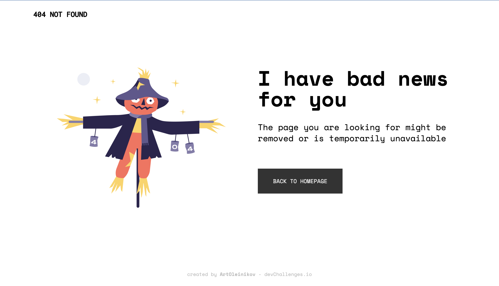

<!-- Please update value in the {}  -->

<h1 align="center">404 Not Found</h1>

   Solution for a challenge from  <a href="http://devchallenges.io" target="_blank">Devchallenges.io</a>.

  <h3>
    <a href="https://oleinikovartem.github.io/404-not-found-challenge/">
      Demo
    </a>
     | 
    <a href="https://github.com/OleinikovArtem/404-not-found-challenge">
      Solution
    </a>
     | 
    <a href="https://devchallenges.io/challenges/wBunSb7FPrIepJZAg0sY">
      Challenge
    </a>
  </h3>

<!-- TABLE OF CONTENTS -->

## Table of Contents

- [Overview](#overview)
- [Built With](#built-with)
- [Features](#features)
- [Contact](#contact)

<!-- OVERVIEW -->

## Overview

Hello, this is my learning project on react-tailwindcss.
During this time, I have been learning how to customize tailwindcss and use some classes for responsive layout.

My goal is to complete all the challenges on devchallenges.io and make a video explaining how to do it.

### Built With

<!-- This section should list any major frameworks that you built your project using. Here are a few examples.-->

- [React](https://reactjs.org/)
- [Tailwind](https://tailwindcss.com/)
- [Vitejs](https://vitejs.dev/)
- [gh-pages](https://www.npmjs.com/package/gh-pages)

## Features

<!-- List the features of your application or follow the template. Don't share the figma file here :) -->

This application/site was created as a submission to a [DevChallenges](https://devchallenges.io/challenges) challenge. The [challenge](https://devchallenges.io/challenges/wBunSb7FPrIepJZAg0sY) was to build an application to complete the given user stories.

## Contact

- GitHub [@OleinikovArtem](https://github.com/OleinikovArtem)

